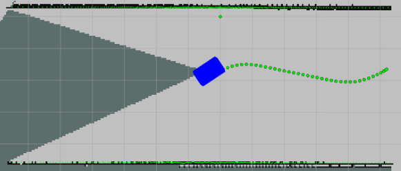

# Trajectory Utils

This ROS package provides utilities for collecting, storing, and visualizing odometry data. It includes functionality to save trajectory data in a specified format and visualize it using markers in Rviz.
<p align="center">
  
</p>

## Overview

The package includes two main components:

1. **Trajectory Saver**: A node that subscribes to odometry data, stores it in a circular buffer, and provides a service to save the trajectory to a file.
2. **Trajectory Reader**: A node that reads saved trajectory data from a file and publishes it as visualization markers.

## Components

### 1. Trajectory Saver

**Functionality**:
- Subscribes to the `/odom` topic to receive odometry messages.
- Stores the latest odometry data in a circular buffer.
- Provides a service (`/save_trajectory`) to save the buffered trajectory data to a file.

**Key Classes and Methods**:
- `OdomBuffer`: Manages the buffer and the saving of trajectory data.
  - `odomCallback`: Updates the current odometry data from the subscribed messages.
  - `timerCallback`: Samples the current odometry data at a specified frequency (2 Hz).
  - `saveTrajectory`: Saves the trajectory data to a specified file, given a filename and duration.

**Service Message**:
- The service accepts a request with:
  - `string filename`: The name of the file to save.
  - `uint32 duration`: The number of entries to save from the buffer.
- It returns:
  - `bool success`: Indicates if the saving was successful.

**Parameters**:
- `base_file_path`
   - Type: `string`
   - Default Value: `/saved_trajectories/`
   - Description: The base path where the trajectory files will be saved. This path should exist and be writable. The filename provided in the service request will be appended to this path with a .trajectory extension.

### 2. Trajectory Reader

**Functionality**:
- Reads trajectory data from a specified file.
- Publishes the trajectory data as markers to visualize in Rviz.

**Key Functions**:
- `readPointsFromFile`: Reads saved trajectory points from a file and stores them in a vector.
- `publishMarkers`: Publishes the trajectory points as visualization markers in Rviz.

**Parameters**:
- `frame_id`
    - Type: `string`
    - Default Value: `map`
    - Description: The coordinate frame ID used for the odometry data. This helps in defining the reference frame for position data.

- `topic`
    - Type: `string`
    - Default Value: `/trajectory`
    - Description: The topic name to which the node subscribes for receiving odometry data. The node will listen for messages published on this topic to update its internal buffer.

## Installation

To install the package, clone the repository and build it within your ROS workspace:

```bash
cd ~/catkin_ws/src
git clone <repository-url>
cd ~/catkin_ws
catkin_make 
```
## Usage

Starting the Trajectory Saver

- Launch the trajectory saver node:

   ```rosrun trajectory_utils trajectory_saver```

   or
   
   ```rosrun trajectory_utils trajectory_saver _base_file_path:="<path_to_store_files>"```


- Call the save trajectory service:
   (duration is in seconds)
   
   ```rosservice call /trajectory_saver/save_trajectory "{filename: 'trajectory_data', duration: 420}"```

Starting the Trajectory Reader

- Launch the trajectory reader node:

   ```rosrun trajectory_utils trajectory_reader <path_to_saved_file>```

   or

   ```rosrun trajectory_utils trajectory_reader <path_to_saved_file> _frame_id:="<frame_id>" _topic:=<topic>"```

- Open Rviz and add a MarkerArray display ***( marker topic : /trajectory )*** to visualize the trajectory points. 

## Pseudocode for the Trajectory Collection, Storage, and Visualization

### Trajectory Collection

1) Initialize ROS Node
2) Subscribe to /odom topic
3) Create circular buffer
4) Define callback for odometry messages
   - Update current odometry data.
   - Store data in the buffer at a specified frequency.

### Trajectory Storage

1) Define ROS Service
   - Accept filename and duration(s).
2) Open file for writing
3) Write buffered odometry data to file
4) Close file and return success status

### Trajectory Visualization

1) Read saved trajectory data from file
2) Publish points as markers to Rviz
3) Loop and update visualization until node shutdown
